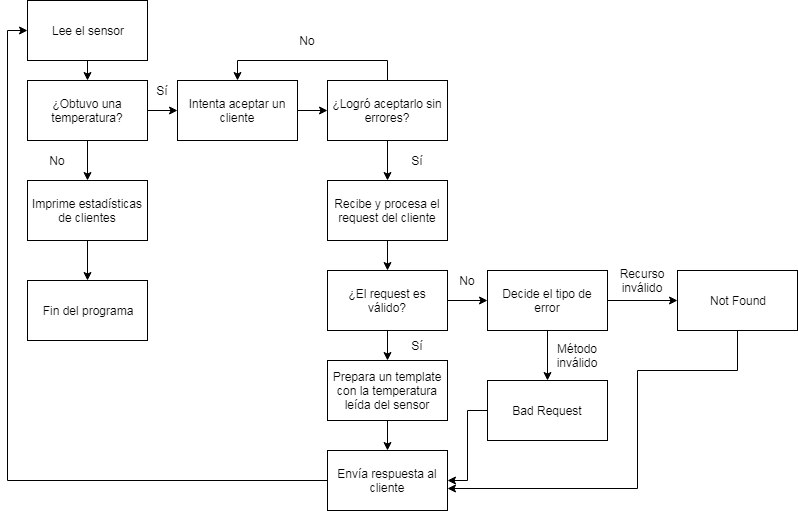

# Informe TP1 - Sensor térmico sobre HTTP

Este informe describe brévemente la solución propuesta para el Sensor térmico sobre HTTP.

A lo largo del desarrollo, fui realizando refactorizaciones del código y en consecuencia varias entregas. 

En principio prioricé pasar las pruebas y tener el programa funcionando correctamente, y luego a medida que fui liberando tiempo intenté mejorar la calidad del código.
En particular, los últimos refactors implicaron modularizar funcionalidades en TDAs e inicializarlos en el stack en lugar de utilizar el heap.

# Servidor

El servidor fue diseñado como un simple programa que lee de a 2 bytes de un archivo binario (sensor) para obtener una temperatura, y luego intenta aceptar clientes hasta poder enviar exitosamente la información leída junto a un template HTML al cliente.

Para esto se cuenta con las siguientes funciones:

## _read_sensor() 
Esta función lee el archivo binario, convierte los bytes leídos de Big-Endian al endianness de la máquina que corre el servidor, y convierte esta lectura a una temperatura por medio de una sencilla fórmula. 

La función devuelve la cantidad de elementos de 2 bytes leídos, de esta forma si devuelve 0 sabemos que ya no quedan bytes por procesar en el sensor.

## _parse_request()
Esta función recibe un buffer con el contenido del request HTTP enviado por el cliente, y revisa que el método del header sea `GET`, y que el recurso sea efectivamente `/sensor`.

Para realizar esto, se utilizó la función `strstr`, la cual dada una subcadena, devuelve un puntero a la primer aparación de la misma dentro de una cadena.

A su vez, si el request es válido la función intenta buscar el User-Agent en el cuerpo del mismo, y si lo encuentra realiza una copia en memoria y lo guarda en un puntero.

## _prepare_body()

Esta función se encarga de reemplazar en un template HTML la subcadena `{{datos}}` por la temperatura leída del sensor.

Para esto, nuevamente hacemos uso de la función `strstr` y parseamos el template línea por línea hasta encontrar la que tenga la subcadena buscada. Se podría haber indicado la posición exacta de inicio de la línea para optimizar la performance de esta tarea pero decidí no hacer esto ya que no es una solución portable en caso de que cambiara el template HTML (y por supuesto, se mantenga el contrato de reemplazar la subcadena específicada).

## _accept_client()
Esta función es la encargada de aceptar clientes, y delegar todo el trabajo de la conexión con el cliente al TDA Socket. 

En caso de que el request del cliente resulte válido y haya un User-Agent en el mismo, también se encarga de utilizar el TDA Browser Counter para actualizar la estadísticas de clientes.

La función devuelve 0 si logró servir apropiadamente a un cliente, o 1 en caso contrario.

## Observaciones sobre el servidor

El loop principal de lectura tal vez resulte poco ortodoxo, pero la idea fue modularizar el comportamiento del servidor en funciones y TDAs, por lo cual quedaron dos while loops donde la condición para seguir iterando es la llamada a la función que se encarga de leer del sensor y luego a la que se encarga de aceptar clientes.

# Cliente

El cliente es un programa muy sencillo, en el cual también se hace uso del TDA Socket para manejar la conexión al servidor.

El mismo recibe un request por entrada estandar o bien como un path para abrir un archivo con el contenido del mismo.

Luego simplemente se intenta enviar este request al servidor, y se imprime por salida estandar la respuesta obtenida.

# TDA Socket

Este TDA se encarga de manejar todo lo relacionado a sockets, para evitar repetir código al inicializarlos o bien poder reutilizar los loops de envío y recepción de datos por medio de sockets.

Cuenta con las siguientes funciones

## _request_done()

Esta función revisa si se ha terminado de leer el request recibido, soporta tanto request del cliente aquí programado o bien de cualquier browser/terminal.

Para esto, sólo busca la cadena "\n" o "\r\n", en caso de encontrarla devuelve un valor distinto de 0.

## socket_init

Inicializa el socket a ser utilizado, dependiendo del flag recibido este socket será pasivo (para el caso del servidor) o activo (en el caso del cliente).

Se encarga de realizar todas las configuraciones pertinentes a cada tipo de socket, y el manejo de errores correspondiente.

## socket_recieve_msg()

Esta función se encarga de recibir información por medio del socket.

Soporta tanto el caso del servidor como del cliente. La diferencia principal es que el servidor debe aceptar una conexión y por lo tanto abrir otro file descriptor para el nuevo socket, y el cliente opera sobre el socket previamente inicializado.

## socket_send_msg()

Esta función se encarga de enviar información por medio del socket.

En caso de tratarse de un socket pasivo, se asegura de cerrar el file descriptor del peer socket.

## socket_destroy()

Esta función se encarga de liberar los recursos de los sockets utilizados.

# Browser Counter

Este TDA se encarga de realizar la estadística de clientes, indicando User-Agent y cantidad de "visitas" al servidor.

Cuenta con las siguientes funciones

## browser_counter_init()

Inicializa el TDA, sólo pide memoria para un arreglo de `field`, la cual es una estructura que tiene user-agent y un contador de visitas.

## browser_counter_resize()

En caso de recibir muchas visitas de distintos clientes, podría darse el caso de no tener más espacio para guardar la información. Esta función se encarga de redimensionar el arreglo de `field`.

## browser_counter_insert()

Esta función agrega un user-agent al TDA e inicializa su contador en 1. En caso de ya encontrarse en el TDA, aumenta en 1 su contador.
Si llegara a superarse la capacidad del TDA, se llama a `browser_counter_resize` para tratar el problema.

## browser_counter_print_stats()

Esta función se encarga de imprimir cada uno de los `field` guardados en el TDA, en orden de aparición.

## browser_counter_destroy()

Esta función se encarga de liberar los recursos utilizados por el TDA.

# Diagrama

Al ser un programa sin demasiada complejidad, el único diagrama que creo que podría aportar valor al informe es un diagrama de flujo sobre cómo operar el servidor.

