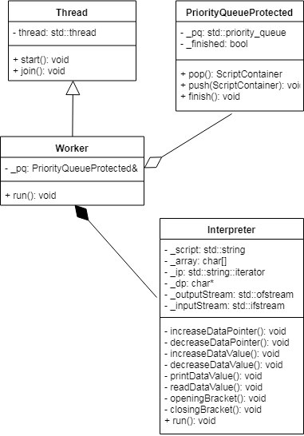

# Informe TP2 - Thread Pool

# Solución

En este trabajo se pidió escribir un intérprete de Brainfuck para ejecutar scripts de este lenguaje, y luego crear una thread pool en la cual se puedan ejecutar scripts en simultáneo.

El desafío más grande en este trabajo fue detectar la zona crítica a proteger para el modo de ejecución thread-pool y evitar tener race conditions entre los threads.
Para esto se utilizó un monitor, el cual se encarga de proteger el recurso compartido por los threads, utilizando mutex y condition variable.

En el caso del TP, este recurso compartido fue la cola de prioridad que funcionaría como contenedor de los scripts ingresados por entrada estandar. 
Las zonas críticas a proteger fueron las operaciones de encolar, desencolar, y finalizar las operaciones en la cola de prioridad (en el caso de mi solución).

Al encolar, se notifica a un thread que esté bloqueado que ya puede desbloquearse y consumir un script de la cola.

Al desencolar, los threads se bloquean mientras que la cola esté vacía y aún queden scripts por procesar por entrada estandar.

Una vez que se termina de procesar scripts por entrada estandar, se verifica que la cola esté vacía y se cambia el flag de finalización de trabajo para indicar a los threads que ya no hay más scripts por procesar. En este momento se lanza una señal a todos los threads que aún estén bloqueados, para finalicen su ejecución.

Los threads fueron encapsulados en una clase propia y además se utilizó una clase Worker para realizar la tarea específica pedida en este TP, que es lanzar un intérprete de Brainfuck con el script desencolado de la cola de prioridad.

# Issues

Creo pertinente indicar algunas cuestiones que sé que no fueron manejadas apropiadamente o que bien se podrían mejorar pero por falta de tiempo no pude implementar.

* Clase ThreadPool: Esta clase se encargará de inicializar los threads con su respectiva referencia al monitor, comenzar su ejecución, y finalmente liberar los recursos de los mismos. Actualmente esto se encuentra en la función main() de `tp.cpp`.

* Clase StdinProcessor: Esta clase se encargará de procesar la entrada estandar e insertar scripts en la cola de prioridad.

* Error en diseño de Worker: Esta clase debería tener una única instancia de Interpreter, y reutilizarla cada vez que se lanza un script, para no tener que instanciarla cada vez que se quiere correr un script.

* Error en diseño de ScriptContainer: La idea de esta clase fue simplemente actuar como contenedor de la metadata de cada script de Brainfuck, el problema fue que necesitaba tener un estado inválido para evitar problemas al desencolar en la clase monitor PriorityQueueProtected y poder devolver un contenedor de todas formas. Esto se podría haber evitado utilizando punteros a ScriptContainer, aunque por lo que investigué en StackOverflow usar punteros para una cola bloqueante no es thread-safe ya que estos podrían ser modificados "desde afuera" de la cola de prioridad, por lo que terminé optando por este diseño.

* Diseño del intérprete: Esto no sé si considerarlo realmente un issue, pero una posibilidad para ser más OOP en el diseño del intérprete hubiera sido utilizar algún tipo de factory de operaciones para evitar utilizar un switch, pero no sé si realmente se gana mucho en este caso en particular. Lo menciono porque creo que será remarcado en la corrección, pero no soy partidario de utilizar patrones de diseño cuando no son realmente necesarios.

* Manejo de errores: No supe implementar correctamente las excepciones de C++ por lo cual para la reentrega intentaré corregir este problema.

* No se protegieron los archivos de entrada/salida, los cuales podrían haber sido compartidos entre threads.

# Diagrama de las clases más importantes

