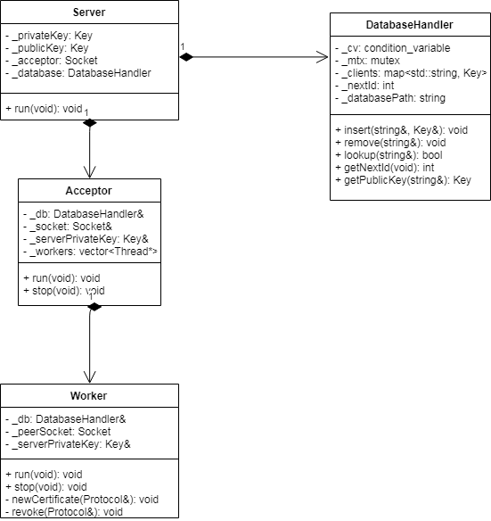
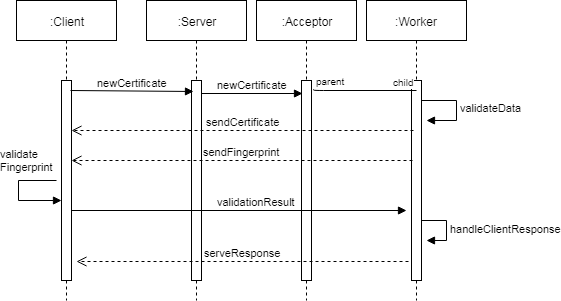

# Informe TP3 - Autoridad Certificante

# Solución

En este trabajo se pidió implementar un servidor que funcionase como una autoridad certificante, capaz de atender múltiples clientes de forma concurrente. También fue parte de la consigna implementar dichos clientes.

Para esto se optó por un enfoque bottom-up al realizar el diseño e implementación del trabajo práctico.

La clase que más trabajo llevó fue Protocol, que es la que encapsula el protocolo establecido en la consigna. En particular, forzar la sobrecarga de los operadores `<<` y `>>` me llevó más tiempo del planeado y terminaron siendo utilizados ambos en este clase (también se utiliza `>>` en la clase Key) de esta forma se cumplió tanto la sobrecarga de estos operadores como el uso de polimorfismo, según se pidió por consigna. 

Una vez implementadas las clases que serían utilizadas tanto por el cliente como el servidor, así como también la adaptación del TDA Socket del TP1, decidí armar el servidor ya que sería la parte más complicada de este trabajo por ser la que implica uso de threads junto con sockets.

El diseño del servidor sigue el blueprint mostrado en el handout servidor-cliente, en donde tenemos un hilo principal que se encarga de esperar un caracter por entrada estandar para finalizar la ejecución del programa y un hilo aceptador que se encarga de establecer conexiones con los clientes.

Este hilo aceptador una vez que recibe una conexión por parte de un cliente, lanza una instancia de Worker en un hilo aparte y se guarda una referencia al mismo para poder detenerlo/finalizarlo cuando sea necesario.

La clase Worker es la encargada de atender al cliente, aquí se hace uso de la clase Protocol para poder manejar tanto la petición de un nuevo certificado como la revocación de uno ya existente.

Aquí es donde surgen los problemas de concurrencia, ya que tanto al crear un nuevo certificado como al revocarlo, se debe acceder a la base de datos de usuarios registrados que tenemos cargada en memoria. Esto puede traer race conditions, por lo cual aquí es dónde se hizo uso de mutex y condition variable para proteger el acceso a esta información.

Otro caso que podría ocasionar un crash en el servidor, es el force shutdown que se puede llegar a realizar al cortar la ejecución del programa al leer una  `q`. Utilizando excepciones pude evitar que al interrumpir abruptamente la conexión de un Worker, se pierdan recursos.

Finalmente el cliente fue implementado simplemente con dos métodos que también hacen uso de la clase Protocol para solicitar un nuevo certificado, y para revocar uno ya existente.

# Diagramas

A continuación se adjunta un diagrama de la clase que considero más importante, el servidor. Y luego un diagrama de secuencia del proceso entero para dar de alta un certificado en el sistema.

## Diagrama de clase - Servidor

Las clases de uso común no fueron diagramadas, sólo aquellas propias del servidor.

## Diagrama de secuencia - Creación de un certificado

* Worker - validateDate: Revisa que el cliente no se encuentre ya cargado en la base de datos.

* Worker - handleClientResponse: Si el cliente nos confirma que la huella fue correctamente validada, respondemos con código de éxito. En caso contrario quita al cliente de la base de datos y se envía el código de solicitud fallida.

* Cliente - validateFingerprint: Se calcula el hash del certificado, y se lo compara con la huella desencriptada. Si son iguales se envía código de éxito, en caso contrario se envía el código de error.

